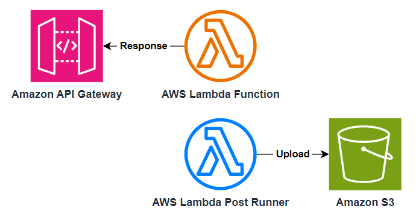

# AWS Lambda Post Runner

Run a command after the AWS Lambda handler function returns.

This is helpful if you want to response to the synchronous invoker (e.g. Amazon API gateway) as soon as possible then run some tasks after that (e.g. uploading files to Amazon S3, sending metrics to Amazon CloudWatch).

## Usage

### As a Lambda Layer

1. Build the binary by running `cargo build --release`, then zip [`scripts/entry.sh`](./scripts/entry.sh) and `target/release/aws-lambda-post-runner` by running `zip -j aws-lambda-post-runner.zip scripts/entry.sh target/release/aws-lambda-post-runner`.
2. Upload the zip as a Lambda layer. Add the layer to your Lambda function.
3. Add an environment variable `AWS_LAMBDA_EXEC_WRAPPER` to the Lambda function with the value `/opt/entry.sh` to enable the runner.
4. Configure the [environment variables](#environment-variables) below to set the command you want to run.

### As a Binary Executable

If you are using a custom Lambda runtime (for rust, golang, c++, etc) or container image, you can run this as a parent process of your main handler process.

1. Build the binary by running `cargo build --release` to get the `target/release/aws-lambda-post-runner` binary executable.
2. Modify the entry command of the Lambda function in your Dockerfile to `aws-lambda-post-runner <handler-command> <handler-args>`.
3. Configure the [environment variables](#environment-variables) below to set the command you want to run.

### Environment Variables

- `AWS_LAMBDA_POST_RUNNER_COMMAND` (required)
  - The command to run after the Lambda handler function returns.
- `AWS_LAMBDA_POST_RUNNER_MODE`
  - Controls when the command is executed.
  - Valid values are:
    - `AfterResponse`
    - `AfterError`
    - Multiple values can be separated by `,`.
  - If not set, the default value is `AfterResponse,AfterError`.
- `AWS_LAMBDA_POST_RUNNER_LOG_LEVEL`
  - The log level. Set to `debug` to print debug logs.

## FAQ

- Q: Will this save my money by running some logic after the Lambda handler returns?
  - No. AWS Lambda charges until the post runner finishes.
- Q: How can I verify that the command is executed after the Lambda handler returns?
  - Try to set the command to something like `sleep 10 && echo done` then invoke the Lambda function via Amazon API Gateway. You should see your HTTP response immediately and the logs show `done` after 10 seconds.
- Q: Can I bring my own binary executable and run it in the command?
  - Yes. E.g. you can package your binary executable in a Lambda layer. [When you add a layer to a function, Lambda loads the layer content into the `/opt` directory of that execution environment](https://docs.aws.amazon.com/lambda/latest/dg/packaging-layers.html#packaging-layers-paths). You can use `/opt/<binary-file>` to run your binary.
- Q: Will the command be executed when the Lambda function timeout?
  - No. When timeout nothing can be executed.
- Q: How does this work?
  - By using [AWS Lambda Runtime Proxy](https://github.com/DiscreteTom/aws-lambda-runtime-proxy), this tool can intercept the Lambda handler function's runtime API call and suppress the freeze of Lambda's execution environment.
- Q: Can I run some logic in another thread of the handler process after the handler function returns, instead of running a separate command?
  - It depends on the runtime. If the runtime is blocked when waiting for the runtime API response, then the post processing logic might not be executed.
  - For example in NodeJS runtime, the Lambda Runtime API client is [implemented in C++](https://github.com/aws/aws-lambda-nodejs-runtime-interface-client/blob/2ce88619fd176a5823bc5f38c5484d1cbdf95717/src/rapid-client.cc). When you suppress the runtime API invocation, the C++ code will wait for the response and block the execution of NodeJS code. You can verify this by add a `setInterval(() => console.log('tick'), 100)` to your NodeJS code and sleep for some seconds in the post runner command. You will see the `tick` stops during the sleep time.

## [CHANGELOG](./CHANGELOG.md)
